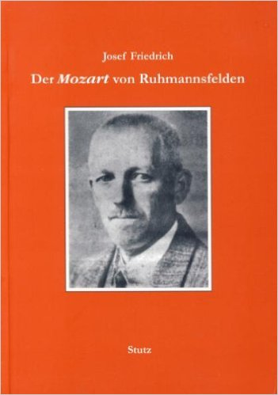
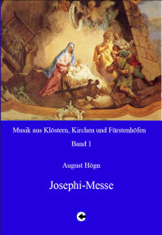





    <h3>Der <i>Mozart</i> von Ruhmannsfelden</h3>
Josef Friedrich, Verlag Karl Stutz, Passau 2007, ISBN 978-3-88849-961-6, vergriffen

    <h3>August Högn - Josephi-Messe F-Dur op. 62</h3>

    Herausgeber: Josef Friedrich, Comes-Verlag, Bad Reichenhall 2007, Partitur mit CD für die Stimmen, ISBN 3-88820-017-2; 29,00 €

<h2>Inhaltsverzeichnis</h2>


