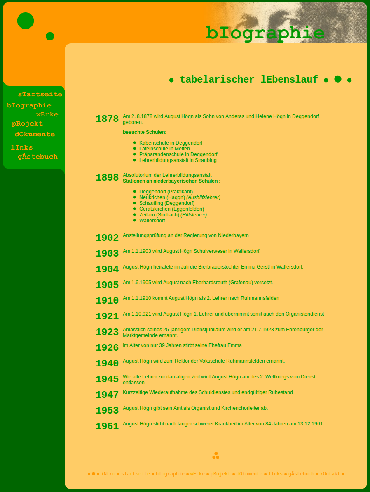

Die Website in dieser Form ist mit [Jekyll](http://jekyllrb.com/) -
einem statischen Webseiten-Generator gebaut worden. Als Theme wird
[TXT](http://html5up.net/txt) von [html5up](http://html5up.net)
verwendet.

<h2 class="major">2002</h2>

Die erste Version der August-Högn-Homepage aus dem Jahr 2002 war eine
Mischung aus statischen HTML- und dynamischen PHP-Seiten - nicht zu
übersehen das eigenwillige Design: Die Farben wurden sorgsam aus den 256
_websicheren_ Farben ausgewählt.

<h2 class="major">2010</h2>

Die Version von 2002 war ein sogenanntes HTML-Tabellen-Layout. Im Jahr
2010 wurde die Website an die modernen HTML und CSS-Standards angepasst.
Als Technologien kamen zum Einsatz:

* YAML 3.2.1
* Jquery 1.4
* Google Font Api
* PHP 5
* CSS 3 (border-radius)

<h2 class="major">2016</h2>

Wie oben beschrieben erfolgte eine Umstellung auf
[Jekyll](http://jekyllrb.com/).